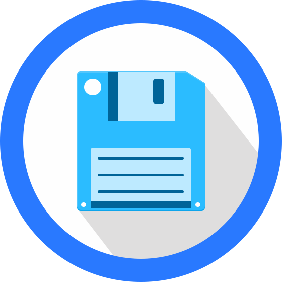

  

filebrowser provides a file managing interface within a specified directory and it can be used to upload, delete, preview, rename and edit your files. It allows the creation of multiple users and each user can have its own directory. It can be used as a standalone app or as a middleware.

## Features

Please refer to our docs at [https://filebrowser.org/features](https://filebrowser.org/features)

filecloud provides a file managing interface within a specified directory and it can be used to upload, delete, preview, rename and edit your files. It allows the creation of multiple users and each user can have its own directory. It can be used as a standalone app or as a middleware.

This project has been forked from
[filebrowser](https://github.com/filebrowser/filebrowser) since 2020.03.
